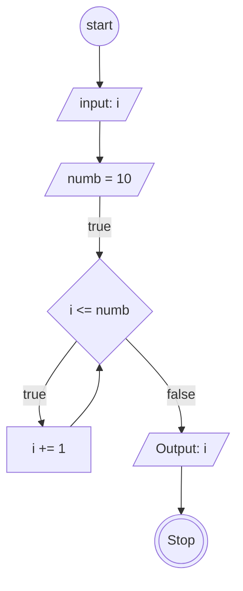
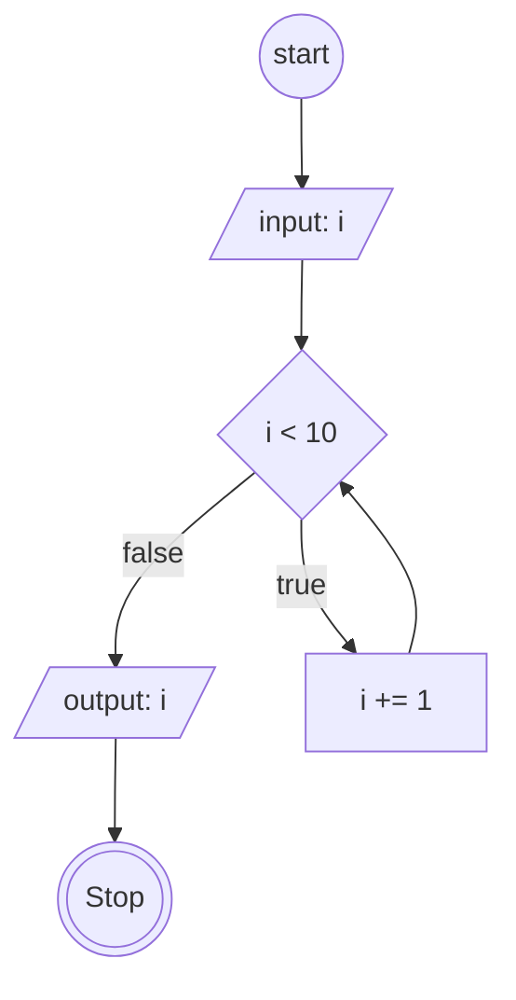
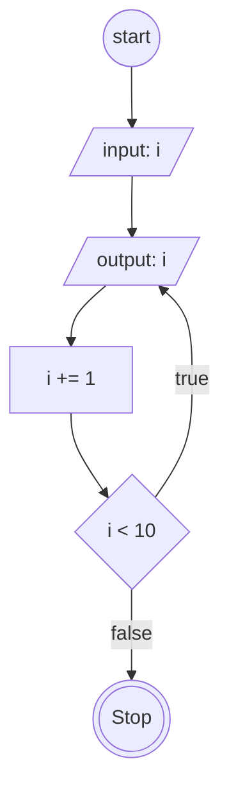

# Flowchart for while dan dowhile

## for

```mermaid
    flowchart TB
        Start@{ shape: circ, label: "start"}
        Iteration@{ shape: lean-r, label: "input: i"}
        Numb@{ shape: lean-r, label: "numb = 10"}
        CheckValue@{ shape: diamond, label: "i <= numb"}
        AddValue@{ shape: rect, label: "i += 1"}

        OutputLog@{ shape: lean-r, label: "Output: i"}

        Stop@{ shape: dbl-circ, label: "Stop"}

        Start-->Iteration-->Numb-->|true|CheckValue-->|true|AddValue-->CheckValue
        

        CheckValue-->|false|OutputLog-->Stop
```

## while

```mermaid
    flowchart TB
        Start@{ shape: circ, label: "start"}
        DeclarationVar@{ shape: lean-r, label: "input: i"}
        CheckCondition@{ shape: diamond, label: "i < 10"}
        PrintValue@{ shape: lean-r, label: "output: i"}

        AddValue@{ shape: rect, label: "i += 1"}

        Stop@{ shape: dbl-circ, label: "Stop"}

        Start-->DeclarationVar-->CheckCondition-->|true|AddValue-->CheckCondition

        CheckCondition-->|false|PrintValue-->Stop
```

## do while

```mermaid
    flowchart TB
        Start@{ shape: circ, label: "start"}
        DeclarationVar@{ shape: lean-r, label: "input: i"}
        PrintValue@{ shape: lean-r, label: "output: i"}
        CheckCondition@{ shape: diamond, label: "i < 10"}
        AddValue@{ shape: rect, label: "i += 1"}

        Stop@{ shape: dbl-circ, label: "Stop"}

        Start-->DeclarationVar-->PrintValue-->AddValue-->CheckCondition-->|false|Stop

        CheckCondition-->|true|PrintValue

```
