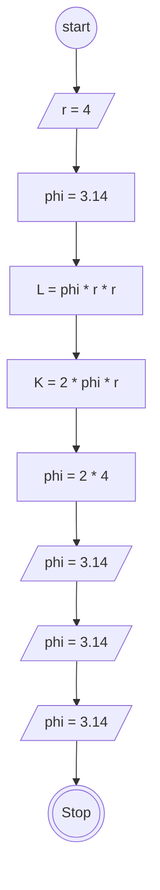

# Heading

```mermaid

flowchart TB
 A@{ shape: circ, label: "start"} 
 B@{ shape: lean-r, label: "r = 4"}
 C@{ shape: rect, label: "phi = 3.14" }
 Luas@{ shape: rect, label: "L = phi * r * r" }
 Keliling@{ shape: rect, label: "K = 2 * phi * r" }
 Diameter@{ shape: rect, label: "phi = 2 * 4" }
 OutputLuas@{ shape: lean-r, label: "phi = 3.14" }
 OutputKeliling@{ shape: lean-r, label: "phi = 3.14" }
 OutputDiameter@{ shape: lean-r, label: "phi = 3.14" }
 Stop@{ shape: dbl-circ, label: "Stop" }

A-->B-->C-->Luas-->Keliling-->Diameter-->OutputLuas-->OutputKeliling-->OutputDiameter-->Stop
```
